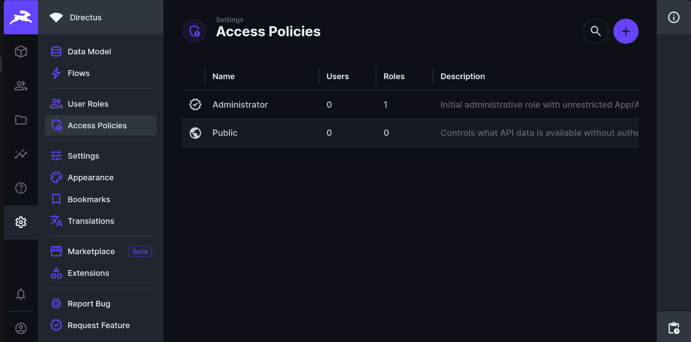
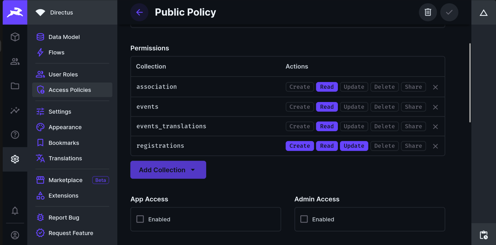

# Clicketing

Clicketing is a web application made for managing registrations, ticketing and event access for events organized by CLIC.

## Developpment

### Initial setup

Two tools are required:

- [`npm`](https://docs.npmjs.com/downloading-and-installing-node-js-and-npm)
- [`docker`](https://docs.docker.com/get-docker/)

Install the git hooks to enforce code formatting and commit names:

```sh
npm i -D
npx husky
```

Install git submodules:

```sh
git submodule update --init --recursive
```

Add execution permissions on directus scripts:

```sh
chmod +x ./directus/load.sh
chmod +x ./directus/populate.sh
```

Apply directus schema and populate the database:

```sh
./directus/load.sh
./directus/populate.sh
```

### Run the stack locally

First, get the directus token and put it in a `.env` file at the root of the repository (see [`.env.example`](.env.example)). Then boot up the full service stack locally, using the `docker compose up` command, from the root of the project. You will be able to access:

- The webapp on [localhost/clicketing](http://localhost/clicketing)
- The directus view on [localhost/directus](http://localhost/directus)

The username is `clic@epfl.ch`.
The admin password is `1234`.

### Add permissions in directus to access items

Go to http://localhost/directus/admin/settings/policies and select Public policy.



Set required policy rules. _(Maybe some are missing, resulting in access error for some collections)_:



### Configuration

The configuration is done through environment variables:

- `DIRECTUS_TOKEN`: Token to access the directus instance. Required. The test token is `1234`
